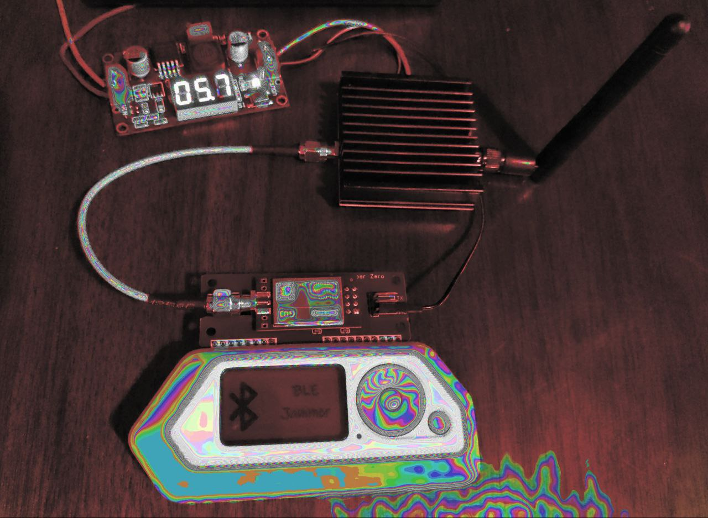

# bluetooth-jammer
DIY bluetooth jammer with off the shelf parts and open source software.

## Components: 
- Flipper Zero 
- NRF24 2.4Ghz transceiver for Flipper Zero
    - Must fit Flipper Zero GPIO pin out
    - Can be be purchased to fit the FZ pinout, or can be soldered to compatible GPIO FZ board, or use jumper wires, etc. 

*Image: Benchtest using a large battery source and a linear voltage regulator tuned to ~5.7 volts to drive the power amplifer. Power amplifier ground is additionally tied to the GPIO ground pin.*

## Optional Components
- 2.4Ghz ower amplifier 
    - SMA adapters as needed 
    - Power supply for power amplifier
- Directional Yagi or other antenna

## Software
- Rogue Master Flipper Zero Firmware w/ plugins
    - Must include GPIO plugin for NRF24 2.4Ghz transceiver (Rogue Master comes loaded with it and an incredible number of other features, but as long as you can drive the NRF24, you can spam BLE)
    - I'm specifically using the FZ-nRF24 plugin
    - https://github.com/RogueMaster/flipperzero-firmware-wPlugins

## Performance
Performance highly depends on the specific hardware chosen. Some antennas are well paired with your tranceiver or power amplifier, others are not. I have personally found the best performance using an omnidirectional dipole antenna, better than a small Yagi antenna. With a power amplifier driven at 5.5V I have seen complete audio jamming of small bluetooth speakers at 30 feet. 

## Disclaimer
Jamming can be illegal, ensure you have permission to jam in your area. I am not responsible for any damages caused by jamming. Use at your own risk. This is intended for educational purposes.